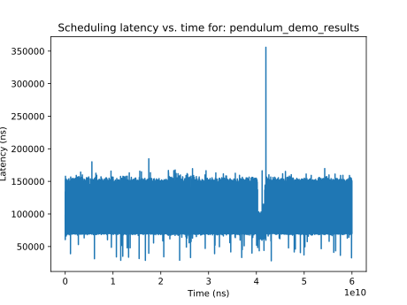
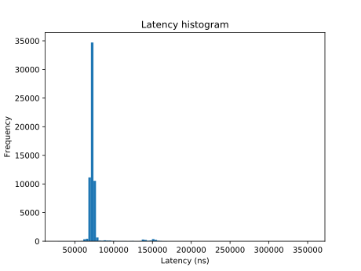
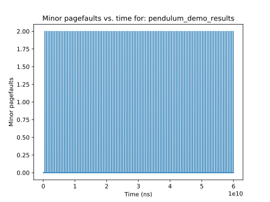
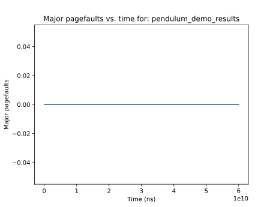

# Pendulum control real-time benchmark

## Plots

<table>
<thead>
  <tr>
    <th></th>
    <th></th>
  </tr>
</thead>
<tbody>
  <tr>
    <td></td>
    
  </tr>
</tbody>
</table>

## Results

<table>
<thead>
  <tr>
    <th><iframe src="experiments/pendulum_demo_results_statistics.txt"></iframe></th>
    <th><iframe src="experiments/pendulum_demo_results.txt"></iframe></th>
  </tr>
</thead>
</table>